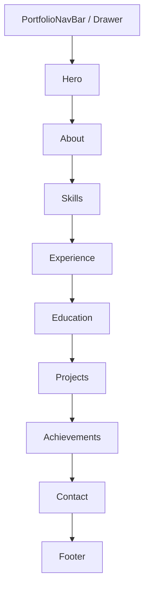
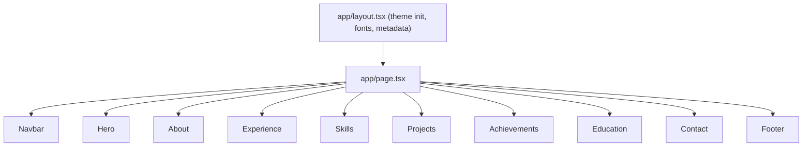
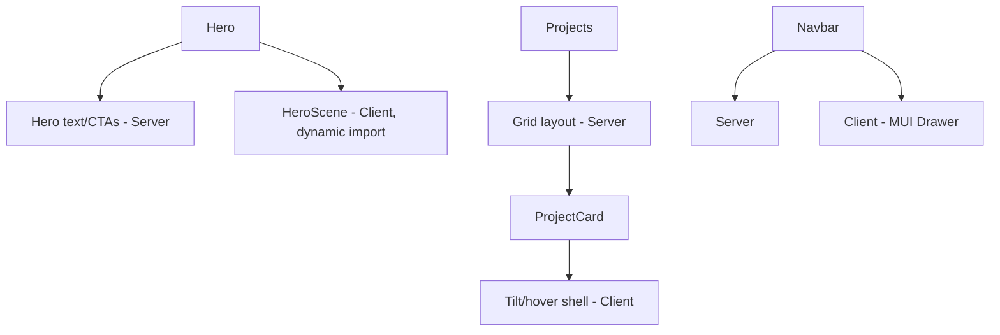

# Portfolio Rewrite — Technical Plan (Flutter → Next.js)

> Status: **Planning phase — no implementation yet.** This document is the single source of truth for the rewrite. Nothing in `## 2. Content Inventory` or `## 3. Content Issues` has been altered from the source Flutter app — factual content is preserved verbatim pending your review.

Sources analyzed:

- Flutter app: `/Users/ztlab66/Documents/utkarsh/Projects/portfolio` (architecture + content, read-only)
- Target repo: `/Users/ztlab66/Documents/utkarsh/Projects/new-portfolio` (currently empty — README + .gitignore only)
- Animation reference: https://utsavd-portfolio.vercel.app/ (motion/interaction patterns only — **not** colors, per your instruction)

---

## 1. Existing Flutter Portfolio — Architecture Analysis

**Type:** Single-page Flutter Web app (CanvasKit), no router — one `MaterialApp.home: PortfolioPage()` containing a `CustomScrollView` of sliver sections. Deployed to GitHub Pages via a single build-and-deploy GitHub Actions workflow (no lint/analyze/test gates).

### Information architecture (current)



All navigation is same-page smooth-scroll (`ScrollController.animateTo` to a `GlobalKey`'s offset) — no deep links, no URL hash sync.

### Key architectural facts

- **State:** Riverpod — theme mode (persisted via `shared_preferences`), active section index (scroll-synced), drawer open state (write-only, never read).
- **Theme:** Custom `ThemeExtension<AppColorScheme>` (semantic tokens: background/surface/border/text/primary/gradients) + Material 3 `ThemeData`, light & dark, manual toggle only (no system-preference follow), default light.
- **Typography:** Space Grotesk (display) + Inter (body), self-hosted in `google_fonts/` with `GoogleFonts.config.allowRuntimeFetching = false` (no network font fetch at runtime — a deliberate, good decision worth preserving).
- **Responsive:** `MediaQuery`-based breakpoints centralized in a `BuildContext` extension (`isMobile <600`, `isTablet 600–1024`, `isDesktop ≥1024`); no `LayoutBuilder`. Nav switches to a drawer below 1024px.
- **Animation:** `flutter_animate` (staggered fade/slide) + `visibility_detector` (scroll-triggered reveal via a shared `AnimatedSection` wrapper) + a few hand-rolled `AnimationController`s (ambient gradient background, shimmer). Custom mouse-tilt card. Typewriter role text. Reduced-motion respected via `MediaQuery.disableAnimations` everywhere.
- **Assets:** No image assets at all — no profile photo, no project screenshots, no logos. Only self-hosted fonts + PWA icons/favicon/OG image + custom SVG cursors in `web/`.
- **Content:** Centralized in one file, `lib/common/constants/resume_content.dart`, but section titles/subtitles and some duplicated copy are hardcoded per-widget.
- **CI/CD:** `.github/workflows/deploy.yml` — build only, no `flutter analyze`, no tests, no PR checks.

### Preserve

- Single-page, scroll-based section flow with a persistent nav (matches content volume; no need for multi-route complexity).
- Self-hosted fonts with zero runtime font fetching.
- Content separated into one typed source of truth (evolve, don't discard, the `resume_content.dart` pattern).
- Systematic reduced-motion handling on every animated component.
- Ambient/gradient background as a subtle, sitewide atmospheric effect.
- Dynamic-repo-name-aware GitHub Pages deploy (`--base-href` from `github.event.repository.name`) — same idea needed for Next.js `basePath`.

### Improve

- **No lint/typecheck/test gates in CI** → add full quality gate (this rewrite's #1 process improvement).
- **Theme doesn't follow system preference initially** → default to system, then allow manual override, persist choice.
- **No deep-linking to sections** → add hash-based anchors (`/#experience`) that work with plain `<a href>`, no JS-router needed on GH Pages.
- **Content duplication** (Hero/About repeat the same summary paragraph verbatim; Achievements bento vs. bullet list overlap) → consolidate into one data source rendered once per section, no verbatim repeats.
- **No project links/images** → data model should support them (optional fields), UI should gracefully omit missing ones (already true) but real assets should be added.
- **Contact form is a `mailto:` stub** ("Swap this method body with Web3Forms POST when ready") → for a static GH Pages site, the honest options are (a) keep `mailto:` link (simplest, zero backend, zero secrets) or (b) wire a third-party form endpoint (e.g. Formspree/Web3Forms) called client-side. Recommendation: keep it simple — a polished `mailto:`/direct contact-card section, not a fake "form" that implies backend processing. Decide in Phase 4 (this needs your input — see Question in Migration Risks).
- **PWA manifest has default Flutter placeholder text** → replace with real name/description or drop PWA manifest entirely if not needed for a portfolio.
- **No responsive intentionality below "mobile"** → add an explicit small-mobile breakpoint (≤380px) for text/touch-target scaling.

### Remove

- Custom DOM-cursor hack (`custom_cursor_web.dart`) — fragile, Flutter-web-renderer-specific; not applicable in Next.js. A CSS-only custom cursor (desktop-only, `pointer: fine` media query) can replace it if desired, but it's low priority (see Animation Strategy §9).
- Dead code patterns being carried over conceptually: unused breakpoint helpers, write-only state, declared-but-unused fonts (Roboto) — not "removing content," just not reproducing dead code in the rewrite.

---

## 2. Content Inventory (verbatim from Flutter source)

All content below is quoted **as-is** from `lib/common/constants/resume_content.dart` and section widgets in `/Users/ztlab66/Documents/utkarsh/Projects/portfolio`. Nothing is invented. Anything not found is explicitly marked "Not found."

### Personal

| Field          | Value                                                                                                                                                                                                                                                                                                                                                                                                                                                            |
| -------------- | ---------------------------------------------------------------------------------------------------------------------------------------------------------------------------------------------------------------------------------------------------------------------------------------------------------------------------------------------------------------------------------------------------------------------------------------------------------------- |
| Name           | Utkarsh Karnik                                                                                                                                                                                                                                                                                                                                                                                                                                                   |
| Title          | Mobile App Developer                                                                                                                                                                                                                                                                                                                                                                                                                                             |
| Tagline        | "A developer who builds scalable apps that users love."                                                                                                                                                                                                                                                                                                                                                                                                          |
| Rotating roles | Software Engineer / Flutter Developer / Mobile Engineer / Riverpod Enthusiast / Cross-Platform Builder                                                                                                                                                                                                                                                                                                                                                           |
| Summary        | "Software Engineer with 4+ years of experience in building scalable, high-performance mobile and web applications. Specialized in Flutter architecture, state management (Bloc, Riverpod), and cross-platform deployments. Proven ability to design user-centric interfaces and implement complex business logic for industries such as healthcare, SaaS, finance, and entertainment. Experienced in CI/CD, testing, and full application lifecycle management." |
| Location       | Gandhinagar, Gujarat, India                                                                                                                                                                                                                                                                                                                                                                                                                                      |
| Email          | utkarshk1871@gmail.com                                                                                                                                                                                                                                                                                                                                                                                                                                           |
| Phone          | +91 9925788460                                                                                                                                                                                                                                                                                                                                                                                                                                                   |

### Social / links

- GitHub: `https://github.com/utkarshk-1871`
- LinkedIn: `https://www.linkedin.com/in/utkarsh-karnik-1b2661176/`
- Resume (Google Drive, not a local PDF): `https://drive.google.com/file/d/1vs2dnru_ws8mKEXfO7uM1SCFlFz_JEt1/view?usp=sharing`
- Twitter/X: **Not found**

### Experience

1. **Mobile App Developer** — Zignuts Technolab Pvt Ltd — Gandhinagar, India — Jul 2022 – Present
   - Developed and maintained production-grade Flutter apps with complex UI and backend integrations.
   - Utilized Bloc and Riverpod for robust state management in scalable codebases.
   - Integrated third-party SDKs (Firebase, Stripe, RevenueCat) and services (Google Maps, In-App Purchases).
   - Led mobile releases and ensured quality through rigorous testing and CI/CD pipelines.
2. **Mobile App Developer Intern** — Zignuts Technolab Pvt Ltd — Gandhinagar, India — Jan 2022 – Jul 2022
   - Supported senior developers in application development and bug fixes.
   - Gained hands-on experience with Flutter and real-world deployment practices.

### Projects (no links or images set on any of them currently)

1. **Charades Game** — "Sensor-driven game using Gyroscope and Accelerometer with monetization via Google Ads and in-app purchases." — Flutter, Bloc, Google Play Services, Google Ads, In-App Purchases
2. **Health Monitoring App** — "Connected wearable devices for health tracking with native widgets and real-time data visualization." — Flutter, Deep-Linking, Analytics, Crashlytics, Method Channel
3. **White-Label Hospitality App** — "Scalable white-label apps for hotels, bars, and golf clubs with automated CI/CD deployments." — Flutter, Riverpod, Firebase, Google Maps, CI/CD
4. **Music Insights App for Artists** — "Analytics dashboard for music artists with subscription model, push notifications, and location insights." — Flutter, Riverpod, Firebase Auth, Push Notifications, Google Maps
5. **Medical Tanker Management Software** — "Custom responsive UI for tanker tracking and admin tools with custom data tables." — Flutter, Bloc, Responsive Web Design, Custom Tables
6. **SaaS Resource Management** — "Modules for resource planning, asset tracking, and geofencing with full analytics suite." — Flutter, Google Maps, Analytics, Crashlytics, Geofencing

### Skills (by category, exactly as listed)

| Category               | Skills                                                   |
| ---------------------- | -------------------------------------------------------- |
| Programming Languages  | Dart, Kotlin, Python                                     |
| Frameworks & Libraries | Flutter, Jetpack Compose, Numpy, Pandas                  |
| State Management       | Riverpod, Provider, Bloc, GetX                           |
| Tools                  | Android Studio, VS Code, Git, Github Actions             |
| Backend & APIs         | Firebase, Strapi, Stripe, RevenueCat, REST APIs, GraphQL |
| DevOps & Architecture  | CI/CD, MVVM, MVC                                         |
| Testing                | Automation Testing, Unit Testing, Integration Testing    |

### Education

1. Charotar University of Science and Technology (CHARUSAT) — B.Tech in Computer Science and Engineering — Nadiad, India — 2018–2022 (GPA not found)
2. Advait Vidyaniketan — High School — Bharuch, India — 2016–2018 (GPA not found)

### Achievements (certifications: **not found** — achievements only)

- Successfully led end-to-end delivery of 8+ Flutter applications.
- Published multiple apps on the Play Store and App Store.
- Designed and maintained CI/CD workflows for production pipelines.
- Consistently delivered projects on time and aligned with client expectations.
- Bento stat cards: "8+ Apps / End-to-end Flutter delivery", "Published / Play Store & App Store releases", "CI/CD / Production pipeline workflows", "On Time / Consistent client delivery"

### Stats (About section)

`4+` Years Experience · `8+` Apps Delivered · `6` Industries Served · `2` Platforms (iOS & Android)

### Assets available for reuse

- Fonts: Inter + Space Grotesk TTFs in `google_fonts/` (Regular/Medium/SemiBold/Bold) — reusable as-is (convert to woff2, self-host).
- `web/og-preview.png`, `web/favicon.png`, PWA icons — reusable as starting points, likely need redesign for the new brand.
- **Missing, needs to be supplied by you before launch:** profile photo, project screenshots, a local resume PDF, company/education logos (optional). _(Per your earlier answer, you'll provide these during implementation — tracked as explicit TODOs in Phase 3, not fabricated placeholders.)_

---

## 3. Content Issues For Your Review (not silently changed)

| #   | Issue                                                                                                                                                                                     | Where                                              |
| --- | ----------------------------------------------------------------------------------------------------------------------------------------------------------------------------------------- | -------------------------------------------------- |
| 1   | Years of experience mismatch: app content says "4+ years," `web/index.html` SEO/noscript says "3+ years."                                                                                 | `resume_content.dart` vs `web/index.html`          |
| 2   | Industry list mismatch: summary says "healthcare, SaaS, finance, and entertainment"; About paragraph 2 says "healthcare, SaaS, hospitality, and entertainment" (finance vs. hospitality). | `about_section.dart`                               |
| 3   | Location format inconsistent: personal location includes "Gujarat"; job locations omit it ("Gandhinagar, India").                                                                         | `resume_content.dart`                              |
| 4   | Summary paragraph duplicated verbatim in both Hero and About.                                                                                                                             | `hero_section.dart`, `about_section.dart`          |
| 5   | Achievements bento cards and the achievements bullet list say largely the same four things (8+ apps, Play/App Store, CI/CD, on-time) — redundant.                                         | `achievements_section.dart`, `resume_content.dart` |
| 6   | Employment end date "Jul 2022 – Present" — confirm still accurate for a 2026 relaunch.                                                                                                    | `resume_content.dart`                              |
| 7   | No links (Play Store / App Store / demo) on any of the 6 projects despite UI supporting them.                                                                                             | `resume_content.dart`                              |
| 8   | No profile photo, no project screenshots, no local resume PDF in the repo.                                                                                                                | assets                                             |
| 9   | GitHub URL mismatch: profile link is `github.com/utkarshk-1871`; SEO `og:url` uses `utkarsh-karnik.github.io`.                                                                            | `resume_content.dart` vs `web/index.html`          |
| 10  | Capitalization inconsistencies: "Github Actions" (should be "GitHub Actions"), "Numpy" (should be "NumPy").                                                                               | `resume_content.dart`                              |
| 11  | PWA manifest has unedited Flutter template text: `"description": "A new Flutter project."`                                                                                                | `web/manifest.json`                                |
| 12  | No Twitter/X link anywhere despite Twitter Card meta tags being present.                                                                                                                  | `web/index.html`                                   |
| 13  | No certifications listed — only achievements. Confirm this is accurate (no certs to add).                                                                                                 | —                                                  |
| 14  | No GPA/grade on either education entry — confirm intentional.                                                                                                                             | `resume_content.dart`                              |
| 15  | Contact form UI hints use _your_ name/email as placeholder text instead of generic placeholder copy ("Jane Doe", "you@example.com").                                                      | `contact_form.dart`                                |
| 16  | Contact form is a non-functional stub (`mailto:` only) with a TODO comment about swapping in a real backend later.                                                                        | `contact_form.dart`                                |
| 17  | Roboto font is declared in `pubspec.yaml` and bundled but never actually used in the theme (Inter + Space Grotesk are used instead).                                                      | `pubspec.yaml` vs `app_fonts.dart`                 |

**You confirmed:** these will be reviewed and corrected by you before/at implementation time rather than decided here — this list is the authoritative tracker for that review.

---

## 4. New Website Vision

**Direction:** modern, minimal, technical, premium — a portfolio that _demonstrates_ frontend engineering craft rather than describing it. Motion should be purposeful (reveal, guide attention, provide feedback) not decorative-for-its-own-sake. One confident 3D centerpiece in the hero, restrained CSS/Framer Motion elsewhere. Typography-led design (large, confident type, generous whitespace) rather than icon/gradient-soup, which is the "generic AI portfolio" tell. Distinct color identity — **not** copied from the reference site (interaction/motion patterns only were referenced from it, per your instruction; final palette to be defined fresh in Phase 2, informed by the existing Flutter dark/light tokens as a starting point).

---

## 5. Technology Stack & Rationale

| Dependency                                                                        | Version (target)                                                                       | Why                                                                                                                                   | Bundle impact                                                                          | Lighter alternative                                                                                                                                                                   |
| --------------------------------------------------------------------------------- | -------------------------------------------------------------------------------------- | ------------------------------------------------------------------------------------------------------------------------------------- | -------------------------------------------------------------------------------------- | ------------------------------------------------------------------------------------------------------------------------------------------------------------------------------------- |
| Next.js                                                                           | 15.x (App Router)                                                                      | Static export (`output: 'export'`), file-based routing, `next/font`, metadata API — all GH-Pages-compatible                           | Framework baseline, tree-shaken per route                                              | Vite + React Router (loses `next/font`, metadata conventions; not chosen)                                                                                                             |
| React                                                                             | 19.x                                                                                   | Required by Next 15; Server Components reduce client JS                                                                               | N/A                                                                                    | —                                                                                                                                                                                     |
| TypeScript                                                                        | 5.7+                                                                                   | Type safety for content models, catches build errors before deploy                                                                    | 0 (dev-only)                                                                           | —                                                                                                                                                                                     |
| Tailwind CSS                                                                      | v4                                                                                     | Utility-first layout/spacing/typography, near-zero unused CSS via its Oxide engine, CSS-first config                                  | Only classes used ship                                                                 | Vanilla CSS modules (more manual work, rejected)                                                                                                                                      |
| MUI (Material UI)                                                                 | v6/v7 (`@mui/material` + `@mui/material-nextjs`)                                       | Accessible, battle-tested complex primitives (Dialog, Menu, Tooltip, Snackbar) that are hard to build correctly from scratch          | Non-trivial (~30–50kb gz for used components); **scope deliberately narrow** — see §16 | Radix UI / Headless UI (smaller, less "batteries included"; not chosen since you explicitly want MUI)                                                                                 |
| three.js                                                                          | latest stable                                                                          | Underlying WebGL engine for the hero scene                                                                                            | Loaded only via dynamic import when hero mounts, never in main bundle                  | —                                                                                                                                                                                     |
| @react-three/fiber                                                                | v9.x                                                                                   | React renderer for three.js — declarative scene graph, plays well with React 19 concurrent rendering                                  | Same lazy-loading strategy as three.js                                                 | Raw three.js imperative code (more code, harder to keep in sync with React lifecycle; rejected)                                                                                       |
| @react-three/drei                                                                 | latest                                                                                 | Helpers (`useGLTF`, `Float`, `PerformanceMonitor`, adaptive DPR) so we don't hand-roll common R3F utilities                           | Tree-shakeable, only used helpers bundled                                              | Hand-written helpers (more code to maintain; only worth it if drei's footprint becomes a problem — it won't for the small helper set we need)                                         |
| Framer Motion (`motion`)                                                          | latest                                                                                 | Scroll-driven reveals, magnetic buttons, text reveals, page-load choreography — the "animation library where appropriate" requirement | ~30kb gz, but replaces multiple hand-rolled solutions                                  | CSS-only animations + `IntersectionObserver` (viable for simple reveals; kept as the default for _simple_ fades, Framer Motion reserved for interactive/gesture-driven bits — see §7) |
| ESLint                                                                            | v9 (flat config) + `eslint-config-next`, `typescript-eslint`, `eslint-plugin-jsx-a11y` | Enforced zero-warning CI gate                                                                                                         | dev-only                                                                               | —                                                                                                                                                                                     |
| Prettier                                                                          | v3.x + `prettier-plugin-tailwindcss`                                                   | Consistent formatting, auto-sorts Tailwind classes                                                                                    | dev-only                                                                               | —                                                                                                                                                                                     |
| pnpm                                                                              | latest                                                                                 | Fast installs, disk-efficient, first-class CI caching (your choice)                                                                   | dev-only                                                                               | —                                                                                                                                                                                     |
| Vitest + React Testing Library                                                    | latest                                                                                 | Component/unit tests                                                                                                                  | dev-only                                                                               | Jest (heavier config; not chosen)                                                                                                                                                     |
| `@axe-core/react` or `eslint-plugin-jsx-a11y` (build-time) + manual Lighthouse CI | latest                                                                                 | Accessibility checks that run in CI, not just at runtime                                                                              | dev-only                                                                               | —                                                                                                                                                                                     |

**Explicitly not adding:** state management library (no global state complex enough to need Redux/Zustand — local component state + a small ThemeContext suffice), CSS-in-JS runtime beyond MUI's own Emotion (avoid a second styling runtime), analytics SDKs (add later only if requested — no third-party scripts by default per Security §20), a headless CMS (content lives in typed TS files per §14 — no backend needed for a static resume site).

---

## 6. Next.js + GitHub Pages Architecture

This site is fundamentally a **single route** (`/`) with in-page anchor navigation, which sidesteps almost all of the classic "SPA router on GitHub Pages" problems.

**`next.config.ts` (planned shape):**

```ts
import type { NextConfig } from "next";

const repoName = "new-portfolio"; // update if repo is renamed; or read from env for CI flexibility
const isCustomDomain = false; // flip true + add public/CNAME if a custom domain is used

const nextConfig: NextConfig = {
  output: "export",
  basePath: isCustomDomain ? "" : `/${repoName}`,
  assetPrefix: isCustomDomain ? "" : `/${repoName}/`,
  trailingSlash: true,
  images: { unoptimized: true },
  reactStrictMode: true,
};

export default nextConfig;
```

Key decisions:

- **`output: 'export'`** — mandatory; GitHub Pages serves static files only, no Node runtime. No Route Handlers, no Server Actions, no ISR/on-demand revalidation, no middleware — all forbidden implicitly by static export and explicitly by GH Pages.
- **`basePath`/`assetPrefix`** — required unless deployed as a user/org root site (`username.github.io`) with a custom domain or as the root repo. For a project page (`username.github.io/new-portfolio`), both must be set or all asset/internal links 404. Drive this from an environment variable set in the GitHub Actions workflow so local dev (`basePath: ''`) and CI build differ without code changes.
- **Custom domain**: if added later, drop `basePath`/`assetPrefix` to `""` and add `public/CNAME` containing the domain — GitHub Pages reads that file from the published output.
- **`.nojekyll`** file must exist in the published output root (add via a `public/.nojekyll` empty file, copied through automatically) so GitHub Pages doesn't run Jekyll and strip `_next/` (leading-underscore folders are Jekyll-ignored by default).
- **Routing/deep links**: no client router needed for section navigation — plain `<a href="#experience">` + native anchor scrolling (with a scroll-margin offset for the sticky navbar) works identically in dev and on GH Pages, with zero JS required, and is inherently SEO/accessibility-friendly. If a future page (e.g. `/uses` or a blog) is added, each becomes its own static route under `app/`, still fully static-exportable.
- **404 handling**: Next's `app/not-found.tsx` is emitted as `out/404.html` during static export; GitHub Pages automatically serves this for any unmatched path.
- **Images**: `images.unoptimized: true` is required (no image server available); use `next/image` anyway for automatic width/height (prevents CLS) with `unoptimized`, and pre-optimize source files (WebP/AVIF, correctly sized) before committing — see §8.
- **Environment variables**: only `NEXT_PUBLIC_*` values are usable (baked in at build time, publicly visible in the bundle — never put secrets here). No secrets are needed for this project at all (no backend, no API keys) — see §20 Security.
- **Build output**: `out/` (Next's static export default), uploaded as the Pages artifact in CI.

---

## 7. Performance Strategy

**Next.js**

- Every section is a Server Component by default (see §16); the only client boundaries are: theme toggle, nav active-state highlighting, the hero's 3D canvas wrapper, and any Framer Motion–driven interactive components.
- `next/dynamic` for the Three.js scene (`ssr: false`, loaded behind a lightweight intersection check so it doesn't block hero text paint).
- Route-level code splitting is automatic (single route here, but component-level `dynamic()` still splits the 3D + heavy animation chunks out of the main bundle).
- No barrel-file re-exports of the whole `components/` or `data/` directories — import directly from source files to keep tree-shaking effective.

**Images**

- WebP (with AVIF fallback only if a meaningful size win, else skip the complexity) generated at 2–3 responsive widths per image, pre-compressed before commit (target <150KB per hero-relevant image, project thumbnails smaller).
- `next/image` with explicit `width`/`height` (or `fill` inside an aspect-ratio container) — zero CLS by construction.
- `loading="lazy"` (Next's default for below-the-fold `next/image`) everywhere except the LCP image (if any) which should use `priority`.

**Fonts**

- Self-host Inter + Space Grotesk via `next/font/local`, using the TTFs already in the Flutter repo's `google_fonts/` (convert to woff2, subset to used weights only: Regular/Medium/SemiBold/Bold).
- `next/font` inlines `@font-face` with automatic `size-adjust`/fallback metrics → no FOIT/FOUT layout shift, and fonts are self-hosted so there's no third-party network request (continuing the Flutter app's `allowRuntimeFetching = false` philosophy).

**CSS**

- Tailwind v4's built-in content scanning ships only classes actually used — no manual `content` globs.
- MUI: enable `cssVariables: true` on the theme so MUI outputs CSS variables instead of a large runtime-computed style sheet per component instance, and keep MUI's Emotion cache server-inserted via `@mui/material-nextjs`'s `AppRouterCacheProvider` to avoid a hydration flash. Scope MUI usage narrowly (§16) so its CSS/runtime footprint stays small relative to the whole page.

**JavaScript**

- Minimize `"use client"` boundaries (§16); most sections render as static HTML with zero hydration cost beyond the small interactive islands.
- No unnecessary dependencies (date libs, lodash, icon-font kits — use inline SVGs or a tiny tree-shakeable icon set like `lucide-react` instead of a full icon font).
- No `console.log`/debug code shipped — enforced by `no-console` ESLint rule at error level in CI.

**Three.js (dedicated plan)**

- Loaded only for the hero, only via `next/dynamic(() => import('@/three/HeroScene'), { ssr: false })`, and only after a `PerformanceMonitor`/capability check (see below) decides it's worth loading at all.
- Low-poly / procedural geometry only (e.g. a single `IcosahedronGeometry` with a distortion/noise shader, or an instanced particle field) — no imported 3D model files (avoids `.glb` payload + `useGLTF` loading cost entirely, and avoids the "generic 3D asset" look).
- Cap `dpr` via `<Canvas dpr={[1, 1.5]}>` (drei/R3F prop) instead of the device's native pixel ratio, which can be 3+ on high-end phones.
- One `requestAnimationFrame` loop (R3F's internal render loop) — no competing manual loops; pause rendering (`frameloop="demand"` or manually stopping the invalidate loop) when the canvas scrolls out of view via `IntersectionObserver`.
- `prefers-reduced-motion: reduce` → skip mounting the 3D scene entirely and render a static gradient/SVG fallback instead of a frozen 3D frame.
- Mobile: either render a cheaper variant (fewer particles/segments, no post-processing) or skip 3D entirely below a viewport-width threshold and use a CSS/2D fallback (see §9) — decided per-device via a `matchMedia` + rough GPU heuristic (`navigator.hardwareConcurrency` / connection type as a coarse signal), not a fragile GPU-sniffing library.
- No unnecessary React re-renders driving the scene: mouse-parallax and similar inputs update a `useRef`/imperative Three.js object transform directly inside the render loop, never via `setState`.
- If, after prototyping in Phase 5, the 3D hero doesn't clearly outperform a well-executed CSS/SVG alternative on visual impact for the added weight/complexity, the plan defaults to the CSS/2D version instead (per your Important Rule #7/#8) — this is a build-time decision point, not a foregone conclusion.

---

## 8. Three.js / Animation Strategy — Concept Evaluation

| Animation                                                                              | Technology                                                                                    | Visual Impact |                       Perf Cost | Mobile Behavior                                                                  | Recommendation                                                                                                           |
| -------------------------------------------------------------------------------------- | --------------------------------------------------------------------------------------------- | ------------: | ------------------------------: | -------------------------------------------------------------------------------- | ------------------------------------------------------------------------------------------------------------------------ |
| Interactive 3D hero object (procedural geometry, mouse parallax, subtle auto-rotation) | R3F + drei, lazy-loaded                                                                       |          High |                          Medium | Simplified geometry or CSS gradient fallback below a width/capability threshold  | **Adopt** — single hero centerpiece                                                                                      |
| Floating/ambient particles                                                             | R3F `InstancedMesh` (if paired with the hero) or pure CSS (if standalone)                     |        Medium |                      Low–Medium | Reduce count or drop to CSS-only                                                 | **Adopt in hero only**, not sitewide                                                                                     |
| Abstract geometric object (distorted icosahedron/torus, shader-based)                  | R3F + a custom/`MeshDistortMaterial`-style shader                                             |          High |                          Medium | Reduce segment count                                                             | **Adopt** — this is the actual hero object                                                                               |
| Interactive developer-themed 3D scene (e.g. 3D laptop/keyboard model)                  | R3F + imported `.glb`                                                                         |   Medium–High | High (asset loading + geometry) | Poor — heavy on mobile GPUs, slow to load                                        | **Reject** — asset weight and "stock 3D model" look conflict with performance and premium-not-generic goals              |
| Mouse-responsive depth/parallax on 2D layers                                           | CSS `transform` + pointer listeners (or Framer Motion `useSpring`)                            |        Medium |                        Very low | Reduced intensity or disabled (no mouse)                                         | **Adopt** — cheap, effective on section backgrounds                                                                      |
| 3D skill visualization (skills orbiting in 3D space)                                   | R3F                                                                                           |        Medium |                     Medium–High | Hard to make legible/usable on touch                                             | **Reject** — prefer a 2D skill grid/marquee with hover states (also avoids the generic-template "orbiting icons" cliché) |
| Scroll-driven reveals (fade/slide-in per section, timeline draw-in)                    | Framer Motion `useInView`/`useScroll`, or plain CSS + `IntersectionObserver` for simple cases |          High |                             Low | Same, full-speed                                                                 | **Adopt** broadly — primary motion language of the site                                                                  |
| Magnetic buttons (CTA follows cursor slightly)                                         | Framer Motion spring on pointer position                                                      |        Medium |                        Very low | Disabled on touch devices (no hover)                                             | **Adopt** for primary CTAs only                                                                                          |
| Text reveal animations (headline mask/gradient sweep on scroll into view)              | Framer Motion or CSS `@keyframes` + `background-clip`                                         |          High |                             Low | Same                                                                             | **Adopt** for section headings                                                                                           |
| Project card interactions (tilt, spotlight/glow on hover)                              | CSS `transform`/`radial-gradient` follow, no JS libraries needed                              |   Medium–High |                             Low | Tap = static (no hover) — ensure cards look complete without hover               | **Adopt**                                                                                                                |
| Smooth section transitions                                                             | CSS scroll-margin + native anchor scroll; no page transitions needed (single route)           |        Medium |                        Very low | Same                                                                             | **Adopt** (already implied by single-page architecture)                                                                  |
| Custom cursor interactions                                                             | CSS-only, `pointer: fine` media query gated                                                   |    Low–Medium |                        Very low | N/A (no cursor on touch) — must not remove native cursor semantics/accessibility | **Optional, low priority** — nice-to-have, skip if it risks accessibility or time budget                                 |
| Subtle ambient background effects (gradient mesh/aurora, grain)                        | CSS `@keyframes` on gradient position/opacity, or a single low-cost canvas                    |        Medium |                        Very low | Same, maybe simplified                                                           | **Adopt sitewide** — carries forward the Flutter app's ambient-background concept                                        |

**Principle applied throughout:** every "Adopt" row is chosen for high visual impact _relative to_ its performance cost; every "Reject" row lost specifically on the cost/impact ratio or on the "looks like a generic template" risk — not because 3D/animation itself is bad.

---

## 9. Dark & Light Theme Architecture

**Ownership rule:** design tokens (colors, radii, shadows, spacing scale) are defined **once**, as CSS variables, and consumed by both systems — neither Tailwind nor MUI "owns" color; a shared `theme/tokens.css` (or generated via a single TS tokens file) does.

- **CSS variables** (`--color-bg`, `--color-surface`, `--color-text-primary`, `--color-accent`, `--color-border`, etc.) defined for both `:root` (light) and `[data-theme="dark"]` (or `.dark`) scopes.
- **Tailwind v4**: reads the same variables via `@theme inline { --color-bg: var(--color-bg); }`-style mapping (Tailwind v4's CSS-first theme config supports referencing runtime CSS variables directly), and uses the `dark:` variant driven by a `class`/`data-attribute` strategy (not `media`, so manual override works) — Tailwind owns **utility application** (layout, spacing, typography scale, responsive variants), not color _definition_.
- **MUI**: theme created with `cssVariables: true` and its `palette` values pointing at the _same_ CSS variables (via `createTheme({ cssVariables: true, colorSchemes: { light: {...}, dark: {...} } })`) — MUI owns **component-level theme primitives** for the handful of MUI components actually used (§16), reading the same source of truth, never inventing its own colors.
- **Three.js scene colors**: read the same CSS variables at mount time (via `getComputedStyle`) or via a small shared JS token module imported by both the theme and the scene, so the 3D scene's palette always matches the active theme without duplication.
- **No FOUC / correct on first paint**: an inline, render-blocking `<script>` in `app/layout.tsx` (a Next.js pattern compatible with static export — it's just an inline script tag, no server logic) reads `localStorage` (fallback to `prefers-color-scheme`) and sets the `data-theme`/`class` attribute on `<html>` **before** hydration — this is the standard no-flash technique and works identically whether the HTML was statically generated or not.
- **Persistence & precedence**: on first visit, respect `prefers-color-scheme` (system); once the user manually toggles, persist the explicit choice to `localStorage` and it takes precedence over system changes thereafter (matches the plan's "respect system initially, allow manual override" requirement — an improvement over the Flutter app's manual-only, light-default behavior).
- **Reduced motion + theme transitions**: theme switches use a short CSS transition on color properties only (never on layout-affecting properties), and skip the transition entirely under `prefers-reduced-motion: reduce`.

---

## 10. UI/UX Structure (Proposed Information Architecture)

Based on the actual content inventory (§2), not an assumed template:

1. **Hero** — Purpose: immediate identity + role + primary CTAs. Content: name, rotating role text, one-line tagline, CTA buttons (View Work, Contact/Resume), the 3D centerpiece. Layout: split (text left, 3D right on desktop; stacked, 3D simplified/behind text on mobile). Animation: staggered text entrance, 3D parallax. Responsive: 3D shrinks/simplifies or becomes a background wash on small screens. Theme: gradient/scene colors swap with theme.
2. **About** — Purpose: narrative context beyond the resume bullet points. Content: single consolidated summary paragraph (deduplicated from Hero, per §1 "Improve"), stats row (Years/Apps/Industries/Platforms). Layout: text + stat cards, two-column on desktop. Animation: stat count-up on scroll into view, text fade-in. Responsive: stacks to one column.
3. **Experience** — Purpose: career timeline. Content: the 2 roles verbatim, with bullets. Layout: vertical timeline (connecting line + node per role) — an improvement over a plain list, still simple given only 2 entries. Animation: line draws in on scroll, entries fade/slide in sequence. Responsive: timeline collapses to a single left-aligned rail on mobile.
4. **Skills** — Purpose: technology breadth by category. Content: the 7 categories verbatim. Layout: grouped chip/badge grid (not percentage bars — deliberately avoiding that cliché, see §8 rationale), grouped by category headings. Animation: chips fade/stagger in per group on scroll; subtle hover lift. Responsive: categories stack; horizontal scroll snap optionally for chip rows on mobile.
5. **Projects** — Purpose: proof of work. Content: the 6 projects verbatim, tech tags, optional links/images once supplied. Layout: responsive card grid (1/2/3 columns by breakpoint). Animation: card tilt/spotlight on hover (desktop), static-but-complete on touch. Responsive: single column, no hover-dependent info hidden from touch users.
6. **Achievements** — Purpose: quick-scan proof points, consolidated (per §1 "Improve" — dedupe bento vs. bullets into one representation). Content: the 4 highlight stats as a compact strip, bullets folded in as captions rather than a second redundant list. Layout: horizontal stat strip. Animation: count-up/stagger. Responsive: 2-col grid → 1-col.
7. **Education** — Purpose: academic background. Content: the 2 entries verbatim. Layout: simple stacked cards, consistent visual language with Experience timeline but simpler (no ongoing/ending ambiguity). Responsive: stacks naturally, no special handling needed.
8. **Contact** — Purpose: conversion — get in touch. Content: email/phone/social as clear direct-contact cards + `mailto:`/`tel:` links (see §1 Improve note on the form) + resume link/download. Layout: contact-card grid, no fake form unless you decide otherwise. Animation: magnetic hover on primary CTA. Responsive: stacks to single column, tap targets ≥44px.
9. **Footer** — Purpose: closure, secondary nav, social links, copyright. Content: name/year copyright, social icon row, back-to-top. Layout: slim single row. Responsive: wraps to 2 rows on small screens.

No dedicated "Resume" section — resume access is a persistent CTA (nav + hero + footer), matching current content weight (one PDF/link, not enough content for its own section).

---

## 11. Responsive Strategy

| Area                  | Behavior                                                                                                                                                                                     |
| --------------------- | -------------------------------------------------------------------------------------------------------------------------------------------------------------------------------------------- |
| Navigation            | Desktop (≥1024px): horizontal inline links + theme toggle. Tablet/Mobile (<1024px): hamburger → slide-in panel (MUI `Drawer` — see §16), not a scaled-down horizontal nav.                   |
| Hero                  | Desktop: side-by-side text/3D. Tablet: stacked, 3D scaled down. Mobile: 3D either simplified to a background wash or omitted per performance heuristic (§7); text becomes the primary focus. |
| Typography            | Fluid type scale via `clamp()` (not fixed breakpoint jumps like the Flutter app's two-value `isMobile ? x : y`) for smoother scaling across the full range of viewport widths.               |
| 3D scenes             | Geometry/particle-count and DPR scale down below tablet width; below a small-mobile threshold, 3D is replaced by the CSS fallback entirely.                                                  |
| Project cards         | 3 columns (desktop) → 2 (tablet) → 1 (mobile), matching the Flutter breakpoints' _intent_ (`projectColumns`, which existed but was unused — finally implemented here).                       |
| Timeline (Experience) | Centered two-sided timeline on desktop → single left rail on mobile.                                                                                                                         |
| Skills                | Category grid reflows; chip rows wrap (no fixed columns) so it adapts continuously, not just at breakpoints.                                                                                 |
| Images                | `sizes` attribute tuned per breakpoint so the browser downloads an appropriately sized file, not a scaled-down large one.                                                                    |
| Buttons               | Minimum 44×44px touch target on mobile regardless of visual size; magnetic-hover effects no-op on touch (feature-detected via `(hover: hover) and (pointer: fine)`).                         |
| Contact               | Card grid → stacked single column; `tel:`/`mailto:` links remain tappable, not decorative-only.                                                                                              |
| Footer                | Row → two-row wrap; social icons remain a comfortable tap size.                                                                                                                              |

**Explicit principle:** each breakpoint gets an intentional layout decision (documented above), not a linear scale-down — matching the requirement directly.

---

## 12. Accessibility Strategy

- Semantic landmarks: `<header>`/`<nav>`, one `<main>`, `<section aria-labelledby="...">` per content section, `<footer>`.
- Heading hierarchy: single `<h1>` (name, in Hero), `<h2>` per section title, no skipped levels.
- Keyboard: all interactive elements (nav links, theme toggle, project cards, contact links) reachable via Tab in logical order; visible `:focus-visible` ring styled consistently (not the browser default, not removed).
- Color contrast: both theme palettes checked against WCAG AA (4.5:1 body text, 3:1 large text) as part of the theme design step in Phase 2, before any content lands on it.
- ARIA only where semantics don't already cover it (e.g. `aria-current="true"` on the active nav link, `aria-label` on icon-only buttons like the theme toggle and social icons) — no redundant ARIA on elements that are already semantic.
- `prefers-reduced-motion: reduce` disables/short-circuits: 3D scene mount, scroll-reveal animations (content renders visible immediately, no motion), magnetic buttons, ambient background animation.
- Screen reader behavior: decorative elements (ambient background, 3D canvas) get `aria-hidden="true"`; the 3D canvas's _content_ conveys no unique information (it's decorative), so hiding it is correct and lossless.
- Images: every real ``/`next/image` gets meaningful `alt` text (project screenshots describe the project, not "screenshot"); purely decorative images get `alt=""`.
- Contact: if a form is used instead of/alongside direct links, every input has a visible associated `<label>`, inline error messages are announced via `aria-live="polite"`, and validation never relies on color alone.
- Automated checks: `eslint-plugin-jsx-a11y` in the CI lint gate (zero-warning), plus a manual Lighthouse Accessibility pass as part of the performance budget (§23).

---

## 13. SEO Strategy (fully static-export compatible)

- **Metadata**: Next.js Metadata API (`export const metadata` in `app/layout.tsx`/`page.tsx`) — fully supported under `output: 'export'` since it's resolved at build time, not per-request.
- **Title/description**: accurate, corrected copy (post content-review from §3) — no duplicate/mismatched "3+ vs 4+ years" issue carried forward.
- **Open Graph + Twitter Card**: `openGraph`/`twitter` fields in the same metadata export, pointing at a real static OG image (`public/images/og-preview.png`, 1200×630, redesigned — not just re-using the old one verbatim unless you like it).
- **Canonical URL**: set explicitly (accounting for `basePath`) since GH Pages project sites live at a subpath.
- **Sitemap & robots.txt**: `app/sitemap.ts` and `app/robots.ts` (Next's metadata route conventions) — both are statically generated at build time under `output: 'export'`, producing `sitemap.xml`/`robots.txt` in `out/`. Trivial for a one-route site but still correct practice and free groundwork if more routes are added later.
- **Structured data**: a `Person`/`ProfilePage` JSON-LD block (name, jobTitle, sameAs: [GitHub, LinkedIn]) embedded via a small inline `<script type="application/ld+json">` in the layout — static, no server needed.
- **Semantic HTML/heading structure**: covered by §12 (accessibility and SEO heading requirements are the same work).
- **Social preview image**: one real, on-brand 1200×630 image (design task in Phase 2/3), not the Flutter template's `og-preview.png` reused unexamined.

---

## 14. Project Structure

```text
new-portfolio/                     # repo root (per your decision — code lives at root)
├── src/
│   ├── app/
│   │   ├── layout.tsx             # <html> theme-init script, fonts, metadata, providers
│   │   ├── page.tsx               # composes all sections in order
│   │   ├── globals.css            # Tailwind entry + CSS variable token definitions
│   │   ├── sitemap.ts
│   │   ├── robots.ts
│   │   └── not-found.tsx
│   ├── components/                # generic, content-agnostic UI
│   │   ├── Navbar.tsx / MobileNav.tsx
│   │   ├── ThemeToggle.tsx
│   │   ├── Button.tsx
│   │   ├── SectionHeading.tsx
│   │   ├── SocialLinks.tsx
│   │   ├── Footer.tsx
│   │   └── LoadingScreen.tsx
│   ├── sections/                  # one file per §10 section, composes components + data
│   │   ├── Hero.tsx
│   │   ├── About.tsx
│   │   ├── Experience.tsx
│   │   ├── Skills.tsx
│   │   ├── Projects.tsx
│   │   ├── Achievements.tsx
│   │   ├── Education.tsx
│   │   └── Contact.tsx
│   ├── three/                     # isolated so it's never in the main bundle unless imported
│   │   ├── HeroScene.tsx          # "use client", dynamically imported
│   │   └── useDeviceCapability.ts
│   ├── data/                      # §14/15 content — typed, edited without touching UI
│   │   ├── profile.ts
│   │   ├── experience.ts
│   │   ├── projects.ts
│   │   ├── skills.ts
│   │   ├── education.ts
│   │   ├── achievements.ts
│   │   └── social.ts
│   ├── hooks/
│   │   ├── useReducedMotion.ts
│   │   ├── useInViewport.ts
│   │   └── useMediaQuery.ts
│   ├── lib/
│   │   ├── seo.ts                 # metadata helpers
│   │   └── constants.ts
│   ├── theme/
│   │   ├── tokens.css             # CSS variables, light + dark
│   │   ├── muiTheme.ts            # createTheme({ cssVariables: true, ... })
│   │   └── ThemeRegistry.tsx      # "use client" — AppRouterCacheProvider + MUI ThemeProvider + theme-toggle state
│   └── types/
│       └── content.ts             # Experience/Project/Skill/Education/Achievement interfaces
├── public/
│   ├── images/                    # og-preview, project screenshots (to be supplied)
│   ├── icons/                     # favicons, PWA icons
│   ├── resume/                    # resume.pdf (to be supplied)
│   ├── fonts/                     # self-hosted woff2 (converted from Flutter's google_fonts/)
│   └── .nojekyll
├── tests/
│   ├── unit/                      # component tests (Vitest + RTL)
│   └── a11y/                      # axe checks on key sections
├── .github/
│   └── workflows/
│       └── ci-deploy.yml          # quality gate + gated GH Pages deploy (§17)
├── next.config.ts
├── tailwind.config.ts / postcss.config.mjs   # (Tailwind v4 is largely CSS-first; config file kept minimal)
├── tsconfig.json
├── eslint.config.mjs
├── prettier.config.mjs
├── package.json
├── PLAN.md
├── agents.md / cursorrules.md / skill.md / claude.md
└── README.md
```

**Responsibility summary:** `data/` = facts, `types/` = shape of those facts, `sections/` = how a section is composed from data + components, `components/` = dumb, reusable, content-agnostic UI, `three/` = fully isolated and lazily loaded, `theme/` = the single source of truth consumed by both Tailwind and MUI.

---

## 15. Content/Data Architecture

**Decision: typed TypeScript data files (`src/data/*.ts`), not JSON/MDX.**

Rationale: content here is small, structured, and rarely prose-heavy (no blog posts needing Markdown authoring ergonomics) — plain TS objects give full type-checking (a typo in a field name is a build error, not a silent runtime gap), IDE autocomplete, and zero parsing/build-step overhead, while still being trivially editable without touching any UI component. Example shape:

```ts
// src/types/content.ts
export interface ExperienceEntry {
  title: string;
  company: string;
  location: string;
  startDate: string;
  endDate: string | "Present";
  highlights: string[];
}
```

```ts
// src/data/experience.ts
import type { ExperienceEntry } from "@/types/content";

export const experience: ExperienceEntry[] = [
  {
    title: "Mobile App Developer",
    company: "Zignuts Technolab Pvt Ltd",
    location: "Gandhinagar, India",
    startDate: "2022-07",
    endDate: "Present",
    highlights: [
      "Developed and maintained production-grade Flutter apps with complex UI and backend integrations.",
      // ...
    ],
  },
];
```

You update `experience`/`projects`/`skills`/`education`/`achievements`/`social` in `src/data/` and every consuming section re-renders correctly with zero UI code changes — directly satisfying §14's requirement.

---

## 16. Component Architecture — Server vs. Client

**Default: Server Component.** A component only becomes `"use client"` if it needs one of: browser-only APIs, event handlers/state, or a library that requires the client runtime.

| Component                                                                            | Boundary                                                                     | Why                                                                                                                          |
| ------------------------------------------------------------------------------------ | ---------------------------------------------------------------------------- | ---------------------------------------------------------------------------------------------------------------------------- |
| `Navbar` (shell/links/layout)                                                        | Server                                                                       | Static links, no state                                                                                                       |
| `MobileNav` (open/close drawer)                                                      | Client                                                                       | Local `open` state, click handlers                                                                                           |
| `ThemeToggle`                                                                        | Client                                                                       | Reads/writes theme state, click handler                                                                                      |
| `Hero` (text/layout)                                                                 | Server                                                                       | Static content                                                                                                               |
| `HeroScene` (3D canvas)                                                              | Client                                                                       | Canvas, R3F hooks, animation loop — dynamically imported with `ssr: false`                                                   |
| `SectionHeading`                                                                     | Server                                                                       | Purely presentational                                                                                                        |
| `ProjectCard` (static content)                                                       | Server                                                                       | No interactivity required for content                                                                                        |
| `ProjectCard` hover/tilt wrapper                                                     | Client (thin wrapper around the server-rendered card content)                | Needs pointer events; kept as a small client "shell" so the bulk of the card markup can still be server-rendered as children |
| `ExperienceTimeline`                                                                 | Server (layout) + Client only for the scroll-reveal wrapper                  | Reveal-on-scroll needs `IntersectionObserver`/Framer Motion                                                                  |
| `SkillBadge`/chip grid                                                               | Server                                                                       | Static                                                                                                                       |
| `SocialLinks`                                                                        | Server                                                                       | Plain anchors                                                                                                                |
| `Button`                                                                             | Server (plain variant) / the magnetic-hover variant is a thin client wrapper | Keep the common case server-rendered                                                                                         |
| `Footer`                                                                             | Server                                                                       | Static                                                                                                                       |
| `AnimatedSection` (generic scroll-reveal wrapper, mirrors the Flutter app's pattern) | Client                                                                       | Needs `IntersectionObserver`/Framer Motion                                                                                   |
| `LoadingScreen`                                                                      | Client (if used at all)                                                      | Only needed if the hero 3D scene has a perceptible load time worth masking                                                   |
| `ThemeRegistry` (MUI cache + ThemeProvider)                                          | Client                                                                       | MUI's Emotion runtime requires it                                                                                            |

**Do not over-engineer:** no generic "polymorphic" `Box`/`Stack` abstraction layer, no component library scaffolding beyond what §14's component list actually needs — this list _is_ the component inventory, not a subset.

---

## 17. MUI + Tailwind Strategy

**Rule:** Tailwind is the default for everything (layout, spacing, typography, responsive variants, simple interactive states via `hover:`/`focus:`). MUI is used **only** for a short, deliberate list of components where an accessible, keyboard-correct implementation is genuinely hard to get right from scratch:

- `Drawer` (mobile nav panel) — focus trapping, escape-to-close, backdrop, correct ARIA (`role="dialog"`, `aria-modal`) are non-trivial to hand-roll correctly.
- `Tooltip` (if used, e.g. on icon-only social links) — positioning, delay, and screen-reader announcement logic.
- `Snackbar`/`Alert` (only if a contact form with async submit feedback is built — see §1 Improve note) — accessible live-region announcement.
- Possibly `Modal` if a "project details" lightbox is added later — not in the initial scope.

Everything else — buttons, cards, section layout, chips/badges, the timeline, grids — is plain React + Tailwind, styled once, not duplicated in both systems. This directly satisfies the "avoid unnecessary duplication" requirement and keeps MUI's runtime/bundle footprint proportional to its actual usage.

**No conflict, because of single ownership split:**

- Tailwind's `preflight` (CSS reset) is **disabled**; MUI's `CssBaseline` is the one global reset — avoids both systems fighting over base element styles.
- Both read color/spacing from the same CSS variables (§9) — no second color system to keep in sync.
- MUI components used are configured via the shared theme (`muiTheme.ts`), not per-instance `sx` overrides scattered through the codebase, so there's one place to adjust MUI's look.

---

## 18. CI/CD — GitHub Actions Plan

**Single workflow file, two jobs, gated deploy** (`.github/workflows/ci-deploy.yml`):

```yaml
name: CI & Deploy

on:
  push:
    branches: [main]
  pull_request:
    branches: [main]

permissions:
  contents: read
  pages: write
  id-token: write

concurrency:
  group: pages
  cancel-in-progress: true

jobs:
  quality:
    runs-on: ubuntu-latest
    steps:
      - uses: actions/checkout@v4
      - uses: pnpm/action-setup@v4
      - uses: actions/setup-node@v4
        with:
          node-version: 22
          cache: pnpm
      - run: pnpm install --frozen-lockfile
      - run: pnpm typecheck # tsc --noEmit
      - run: pnpm lint # eslint . --max-warnings=0
      - run: pnpm format:check # prettier --check .
      - run: pnpm test # vitest run (only if tests exist)
      - run: pnpm build # next build (output: 'export' -> ./out)
      - uses: actions/upload-artifact@v4 # keep build output for the deploy job
        with:
          name: site
          path: out/

  deploy:
    needs: quality
    if: github.ref == 'refs/heads/main' && github.event_name == 'push'
    runs-on: ubuntu-latest
    environment:
      name: github-pages
      url: ${{ steps.deployment.outputs.page_url }}
    steps:
      - uses: actions/download-artifact@v4
        with:
          name: site
          path: out/
      - uses: actions/configure-pages@v5
      - uses: actions/upload-pages-artifact@v3
        with:
          path: out/
      - uses: actions/deploy-pages@v4
        id: deployment
```

Notes:

- `quality` runs on every push to `main` **and** every PR targeting `main` — PRs never deploy (`deploy` job's `if` excludes `pull_request` events).
- `deploy` only runs after `quality` succeeds (`needs: quality`) and only on a direct push to `main` — satisfies "fail the workflow if any errors occur" and "deploy only after all validation succeeds" simultaneously, with one workflow file instead of two to keep the gate impossible to bypass accidentally.
- `pnpm`/Node caching via `actions/setup-node`'s built-in `cache: pnpm` — no extra cache-action needed.
- Concurrency group `pages` with `cancel-in-progress: true` prevents overlapping deployments (same pattern the Flutter app already uses).
- Node 22 (current Active LTS at plan time) — bump when a newer LTS supersedes it; no reason to pin to a non-LTS version.

---

## 19. Code Quality Requirements & Tooling Config

- **TypeScript**: `strict: true`, `noUncheckedIndexedAccess: true`, `noUnusedLocals`/`noUnusedParameters: true` — CI runs `tsc --noEmit` as a hard gate.
- **ESLint**: flat config (`eslint.config.mjs`) extending `next/core-web-vitals`, `typescript-eslint` (`recommended-type-checked` where feasible), `eslint-plugin-jsx-a11y`. CI runs with `--max-warnings=0` — **warnings fail the build**, not just errors.
- **Prettier**: single shared config + `prettier-plugin-tailwindcss` (auto-sorts class strings) — CI runs `--check`, never auto-fixes in CI (fixes happen locally/pre-commit).
- **No blanket rule disables**: any `eslint-disable` comment must be scoped to the single line/rule it addresses and include a one-line justification comment — never a file-level or blanket disable. This is a project convention enforced by review, tracked in `cursorrules.md`.
- **No `console.*`** in shipped code (`no-console: error`, with a narrow allowance for `console.error` only inside an explicit error-boundary/logging utility if one is added).
- **Dead code**: `unused-imports` ESLint plugin (or TS's own unused checks) catches unused imports/vars automatically; no dead components/data fields left after the content review in §3 is resolved.

---

## 20. Testing Strategy

Meaningful, not coverage-driven:

- **Type checking** (`tsc --noEmit`) — catches the largest class of real bugs for a content-driven site (mismatched data shapes) for free.
- **ESLint + Prettier** — catches the second largest class (a11y issues, style violations) for free.
- **Build validation** (`next build`) — the only way to catch static-export-specific failures (e.g. accidental use of a server-only API) before deploy.
- **Component tests (Vitest + RTL)** — only for components with real logic: `ThemeToggle` (persists + applies correctly), `useReducedMotion`/`useMediaQuery` hooks, the theme-init no-FOUC script's logic (extracted into a testable pure function), nav active-section logic. Not testing purely presentational components (`SectionHeading`, `Button` styling) — low value.
- **Accessibility testing**: `@axe-core/react` (dev-only, console-warns on violations during manual testing) + a Lighthouse Accessibility score check as part of the performance budget gate.
- **Link validation**: a small script (or `linkinator`/`lychee` in CI) that crawls the built `out/` HTML for internal broken links/anchors — catches, e.g., a nav link pointing at a renamed section id.
- **Responsive/theme/reduced-motion testing**: manual QA checklist (documented in the implementation checklist, §25) across the breakpoints in §11, both themes, and with OS-level reduced-motion enabled — not worth automating with visual-regression tooling for a project this size, unless you want to add Playwright screenshot tests later.

---

## 21. Security Considerations

- **Dependencies**: `pnpm audit` (or GitHub Dependabot alerts, enabled on the repo) checked before each release; keep the dependency list intentionally short (§5) to minimize supply-chain surface.
- **External scripts/embeds**: none by default — no analytics, no third-party widgets. If a contact-form service (e.g. Formspree) is added later, it's a client-side `fetch` to their API with no script injection, and its endpoint/public key (not a secret) is the only config needed.
- **Unsafe HTML**: no `dangerouslySetInnerHTML` except the one deliberate, static, hand-written JSON-LD `<script type="application/ld+json">` block (§13) — never populated from unsanitized input.
- **External links**: every `target="_blank"` link includes `rel="noopener noreferrer"`.
- **Secrets**: none required by this architecture (fully static, no backend, no API keys) — nothing should ever need to go in a `.env` beyond a possible non-secret `NEXT_PUBLIC_BASE_PATH`. No secrets committed, ever.
- **Client-side "secrets"**: N/A — reiterating that anything in `NEXT_PUBLIC_*` is public by definition; no sensitive value should ever be prefixed that way.

---

## 22. Migration Phases

| Phase                               | Tasks                                                                                                                                            | Dependencies      | Expected Output                                                        | Key Risks                                                              | Validation                                                                                          |
| ----------------------------------- | ------------------------------------------------------------------------------------------------------------------------------------------------ | ----------------- | ---------------------------------------------------------------------- | ---------------------------------------------------------------------- | --------------------------------------------------------------------------------------------------- |
| **1. Project init**                 | `pnpm create next-app` (TS, App Router, Tailwind), configure `output:'export'`/basePath, ESLint/Prettier/TS strict config, pnpm workspace basics | None              | Buildable empty app, `pnpm build` produces `out/`                      | Wrong basePath breaks all asset paths early                            | `next build` succeeds locally; a static server (`npx serve out`) renders correctly at the base path |
| **2. Design system/theme**          | Define CSS variable tokens (light+dark), MUI theme (`cssVariables:true`), Tailwind dark-mode wiring, theme-init no-FOUC script, `ThemeToggle`    | Phase 1           | Working theme switch, no FOUC, WCAG-AA contrast verified               | MUI/Tailwind token duplication if not careful                          | Manual toggle test + contrast checker on both palettes                                              |
| **3. Content migration**            | Resolve §3 content issues with you, author `src/data/*.ts` + `types/content.ts`, gather/optimize real assets (photo, screenshots, resume PDF)    | Your review of §3 | Typed, accurate content layer; assets in `public/`                     | Content issues carried forward unresolved                              | You sign off on final copy before it's wired into UI                                                |
| **4. Core sections**                | Build all `sections/*.tsx` per §10 with static layout/content (no animation yet), Navbar/Footer, decide contact form vs. direct-links (§1)       | Phase 2, 3        | Fully navigable, content-complete, unstyled-for-motion site            | Section decisions (e.g. Achievements consolidation) need your sign-off | Visual review against §10 spec                                                                      |
| **5. Animations/Three.js**          | Build `HeroScene`, wire scroll-reveal/magnetic/tilt per §8's "Adopt" rows, device-capability gating, reduced-motion fallbacks                    | Phase 4           | Fully animated site matching §7/§8 performance rules                   | 3D scene jank on low-end devices if capability gating is skipped       | Manual test on a throttled/low-end device profile + reduced-motion toggle                           |
| **6. Responsive optimization**      | Pass through every breakpoint in §11, fix any layout-specific issues found                                                                       | Phase 4–5         | Verified responsive behavior at all breakpoints                        | Desktop-first bias sneaking back in                                    | Manual test at each breakpoint listed in §11                                                        |
| **7. SEO/accessibility**            | Metadata, sitemap/robots, JSON-LD, heading audit, focus states, alt text, axe pass                                                               | Phase 4–6         | Lighthouse SEO/A11y scores meet §23 budget                             | Missed alt text on late-added images                                   | Lighthouse run + axe run, zero violations                                                           |
| **8. Testing & quality validation** | Write the component/hook tests in §20, link-check script, run full ESLint/TS/Prettier gate locally                                               | Phase 1–7         | Green `pnpm typecheck && pnpm lint && pnpm test && pnpm build` locally | Tests retrofitted late find real bugs, causing rework                  | All commands pass with zero warnings                                                                |
| **9. GitHub Actions**               | Add `.github/workflows/ci-deploy.yml` per §18, verify on a PR before merging to `main`                                                           | Phase 8           | Green PR check; confidence before first real deploy                    | Pages permissions/environment not yet configured in repo settings      | A test PR shows the `quality` job passing                                                           |
| **10. GitHub Pages deployment**     | Enable Pages (Source: GitHub Actions) in repo settings, merge to `main`, verify live URL, confirm `basePath`, custom domain if applicable        | Phase 9           | Live site at `https://<user>.github.io/new-portfolio/`                 | Wrong basePath only visible in production, not local dev               | Full manual pass on the live URL: nav, theme, animations, all links, Lighthouse on production       |

---

## 23. Migration Risks & Mitigations

| Risk                                                                                                    | Mitigation                                                                                                                                                                                             |
| ------------------------------------------------------------------------------------------------------- | ------------------------------------------------------------------------------------------------------------------------------------------------------------------------------------------------------ |
| Flutter → React mental-model shift (widgets/`setState` vs. components/hooks; declarative-but-different) | No code is ported mechanically — every section is redesigned per §10 from content outward; the Flutter code serves only as a content/behavior reference (this plan), not a translation source          |
| GitHub Pages routing/basePath misconfiguration                                                          | Single-route + anchor-nav architecture (§6) minimizes routing surface entirely; `basePath`/`assetPrefix` centralized in one config value, tested via a local static-server dry run before every deploy |
| Static export feature gaps (no ISR, no Route Handlers/Server Actions, no Image server)                  | Architecture designed around these constraints from the start (§6, §7) rather than discovered late                                                                                                     |
| Three.js bundle size / runtime cost                                                                     | Fully isolated, dynamically imported, capability-gated (§7); procedural geometry only, no `.glb` assets                                                                                                |
| MUI + Tailwind conflicts (double resets, duplicated colors)                                             | Single reset owner (MUI `CssBaseline`, Tailwind preflight off) + single token source (§9, §17)                                                                                                         |
| Theme hydration flash (FOUC)                                                                            | Inline blocking theme-init script before hydration (§9) — standard, static-export-compatible pattern                                                                                                   |
| Image handling without a server-side optimizer                                                          | Pre-optimized source assets + `next/image` with `unoptimized:true` for CLS-safe dimensions (§7)                                                                                                        |
| Font loading layout shift                                                                               | Self-hosted via `next/font/local` with automatic fallback metrics (§7)                                                                                                                                 |
| Mobile GPU performance for 3D                                                                           | DPR cap, capability-based gating, CSS fallback path (§7, §8)                                                                                                                                           |
| Accessibility regressions from motion-heavy design                                                      | `prefers-reduced-motion` short-circuits every animation category (§8, §12); axe + Lighthouse gates (§7 is not a substitute for §12, both are required)                                                 |
| SEO on a JS-heavy SPA-feeling site                                                                      | Content is server-rendered HTML at build time (Server Components + static export) — there's no client-side-only rendering of primary content, so crawlers see full text regardless of JS               |
| Client/server component boundary mistakes (accidentally making everything client)                       | Explicit per-component boundary table (§16) decided up front, reviewed in Phase 4                                                                                                                      |
| Build warnings silently accumulating                                                                    | Zero-warning CI gate (§18/§19) from Phase 1 onward, not bolted on at the end                                                                                                                           |
| Dependency/version incompatibility (Next 15 + React 19 + MUI + R3F)                                     | Verify the specific installed versions together in Phase 1 before building on top of them; pin exact versions in `package.json` rather than broad ranges once verified                                 |
| Contact form ambiguity (mailto stub vs. real backend)                                                   | Explicit decision point flagged in §1/§22 Phase 4 — needs your input before that phase, not assumed                                                                                                    |

---

## 24. Performance Budget

| Metric                                    | Target                                                                |
| ----------------------------------------- | --------------------------------------------------------------------- |
| Initial JS (main bundle, gzipped)         | < 150KB (excluding the lazily-loaded 3D chunk)                        |
| 3D chunk (three.js + R3F + drei, gzipped) | < 200KB, loaded only when the hero mounts and only on capable devices |
| Largest Contentful Paint (LCP)            | < 2.0s (mobile, throttled) / < 1.0s (desktop)                         |
| Cumulative Layout Shift (CLS)             | < 0.05                                                                |
| Interaction to Next Paint (INP)           | < 200ms                                                               |
| Total Blocking Time (TBT)                 | < 150ms                                                               |
| Lighthouse Performance                    | ≥ 95 (mobile)                                                         |
| Lighthouse Accessibility                  | 100                                                                   |
| Lighthouse Best Practices                 | 100                                                                   |
| Lighthouse SEO                            | 100                                                                   |

These are targets to validate against in Phase 7–8, not guarantees prior to implementation — the 3D chunk budget in particular is a hard constraint the animation strategy (§7/§8) is designed to respect.

---

## 25. Final Architecture Proposal

### Recommended stack

Next.js 15 (App Router, static export) · React 19 · TypeScript 5.7 (strict) · Tailwind CSS v4 · MUI v6/v7 (narrow scope) · three.js + @react-three/fiber + @react-three/drei (hero only, lazy) · Framer Motion (scroll/gesture motion) · ESLint 9 flat config + typescript-eslint + jsx-a11y · Prettier 3 + prettier-plugin-tailwindcss · pnpm · Vitest + React Testing Library · GitHub Actions + GitHub Pages.

### Recommended architecture

Fully static Next.js export, single anchor-navigated route, Server Components by default with a small, deliberate set of Client Component "islands" (theme toggle, mobile nav, 3D scene, scroll-reveal wrappers, magnetic buttons) — see §16 for the full boundary table.

### Page/section hierarchy



### Component hierarchy (representative)



### Data architecture

`src/types/content.ts` defines interfaces → `src/data/*.ts` provide typed constants → `src/sections/*.tsx` import and render them. No UI component ever hardcodes portfolio facts.

### Animation architecture

Three.js/R3F confined to `src/three/HeroScene.tsx`, dynamically imported, capability-gated. All other motion (reveals, magnetic buttons, text reveals, card tilt) via Framer Motion or plain CSS, applied as thin client wrappers around server-rendered content, never as a rewrite of the whole section into a client component.

### Theme architecture

Shared CSS-variable tokens (`theme/tokens.css`) → consumed by Tailwind's `dark:` variant and MUI's `cssVariables` palette → toggled via a `data-theme` attribute set by an inline pre-hydration script + persisted in `localStorage`, defaulting to system preference on first visit.

### Deployment architecture

```text
Developer
   ↓
Git Push (main)
   ↓
GitHub Actions triggers ci-deploy.yml
   ↓
Job: quality
   ├─ pnpm install (cached)
   ├─ TypeScript check (tsc --noEmit)
   ├─ ESLint (--max-warnings=0)
   ├─ Prettier --check
   ├─ Vitest
   └─ next build --> out/
   ↓ (only if quality succeeds AND branch is main)
Job: deploy
   ├─ configure-pages
   ├─ upload-pages-artifact (out/)
   └─ deploy-pages
   ↓
GitHub Pages (https://<user>.github.io/new-portfolio/)
```

---

## 26. Implementation Checklist

- [ ] Project setup (`pnpm create next-app`, TS/App Router/Tailwind, repo hygiene)
- [ ] Dependencies installed and pinned per §5, none unused
- [ ] TypeScript strict mode, zero errors
- [ ] ESLint flat config, zero errors/warnings
- [ ] Prettier configured, `--check` clean
- [ ] Tailwind v4 configured, dark mode via class/data-attribute
- [ ] MUI configured (`cssVariables`, `AppRouterCacheProvider`, `CssBaseline`), scope limited per §17
- [ ] Theme: tokens defined, no-FOUC script working, system-preference default, manual override persists
- [ ] Content migration: §3 issues resolved with you, `src/data/*.ts` complete and typed, real assets in place (photo, screenshots, resume PDF)
- [ ] All components built per §16 boundary table
- [ ] Responsive behavior verified at every breakpoint in §11
- [ ] Three.js hero scene: lazy-loaded, capability-gated, reduced-motion fallback, DPR-capped
- [ ] Animations from §8 "Adopt" list implemented; "Reject" list intentionally not implemented
- [ ] Accessibility: heading hierarchy, focus states, contrast, alt text, reduced-motion, axe clean
- [ ] SEO: metadata, OG/Twitter, sitemap.xml, robots.txt, JSON-LD, canonical URL
- [ ] Performance: budget in §24 met via Lighthouse (mobile + desktop)
- [ ] Testing: unit tests for logic-bearing components/hooks, link-check script passing
- [ ] CI/CD: `ci-deploy.yml` green on a test PR before first merge
- [ ] GitHub Pages: Source set to GitHub Actions, first deploy verified live, `basePath` correct, `.nojekyll` present
- [ ] Final validation: full manual pass on the live URL — nav, both themes, all breakpoints, reduced-motion on, all links (including `mailto:`/`tel:`/social/resume) working

---

## Open Decision Needed Before Phase 4

One item genuinely needs your call before implementation reaches the Contact section (§1, §22 Phase 4): **keep the contact section as direct `mailto:`/`tel:`/social links (zero backend, zero secrets, simplest), or wire a real third-party form endpoint (e.g. Formspree/Web3Forms) for an actual on-page form?** Both are static-export-compatible; this only affects Contact section scope, not the overall architecture — no need to decide now, just before Phase 4 begins.
